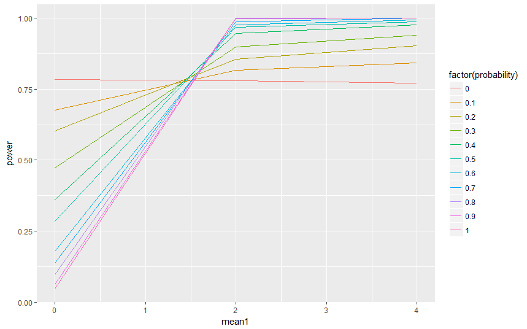

```{r setup, include=FALSE}
knitr::opts_chunk$set(echo = TRUE)
```
```{r, message=FALSE, warning=FALSE, include=FALSE}
library(ggplot2)
library(dplyr)
rmix <- function(n, family_1, par_1, family_2, par_2, p){
  eval(parse(text = paste0("rozkladzik1 <- r", family_1)))
  eval(parse(text = paste0("rozkladzik2 <- r", family_2)))
  
  index <- sample(c(1,2), n, prob = c(p, 1-p),replace = T)
  
  sample_mix <- c()
  for(i in c(1:n)){
    if(index[i] == 1){
      if(length(par_1) == 2){
      sample_mix[i] <- rozkladzik1(1, par_1[1], par_1[2])
      }
      else if(length(par_1) == 1){
        sample_mix[i] <- rozkladzik1(1, par_1)
      }
    }
    else if(index[i] == 2){
      if(length(par_2) == 2){
        sample_mix[i] <- rozkladzik2(1, par_2[1], par_2[2])
      }
      else if(length(par_2) == 1){
        sample_mix[i] <- rozkladzik2(1, par_2)
      }
    }
  }
  return(sample_mix)
}
```
## 1. Wprowadzenie i hipotezy.

Celem sprawozdania jest badanie mocy trzech testów normalności (Shapiro-Wilka, Kołmogorowa-Smirnowa)
w przypadku, gdy dane pochodzą z dwóch rozkładów normlanych:

* Długości próby,
* Średniej rozkładu
* Odchylenie standardowego rozkładu
* Prawdopodobieństwa wylosowania próbki z pierwszego rozkładu.

Celem badania jest również sprawdzenie hipotez:

* Shapiro-Wilka
    + Test normalności Shapiro-Wilka ma największą moc spośród badanych testów.
    + Wartości uzyskane w wyniku przeprowadzenia testu Shapiro-Wilka w dużym stopniu zależą od wielkości próby.
* Kołmogorowa-Smirnowa
    + Wartości uzyskane w wyniku przeprowadzenia testu Kołmogorowa-Smirnowa w dużym stopniu zależą od średniej próby.

### Test Shapiro-Wilka
Bardzo popularny test służący do sprawdzania normalności rozkładu zmiennej losowej. Po raz pierwszy został opublikowany w 1965 roku przez **Samuela Shapiro** i **Martina Wilka**. Test opiera się na wykresie kwantylowym i jest znany ze względu na dużą moc (co zamierzam udowodnić). Hipotezy tego testu są następującej postaci: 

*H0: Rozkład badanej cechy jest rozkładem normalnym.*

*H1: Rozkład badanej cechy nie jest rozkładem normalnym.*

Przykładowy wykres kwantylowy:
```{r, message=FALSE, warning=FALSE, include=FALSE}
library(ggpubr)
```
```{r}
ggqqplot(rt(1000, 5))
```

Ze względu na specyfikę testu zdecydowałem się na następujące wartości próby:
```{r, echo = TRUE}
#================================================================
#ZMIENNE: MEAN1, PROBABILITY (Shapiro)
#================================================================
alpha = 0.05
N = 1000
sample_l = 10
means1 = seq(-10,10, by = 1)
stds1 = 1
means2 = 1
stds2 = 1
prob = seq(0,1,by=0.1)
```
```{r, echo = TRUE}
#================================================================
#ZMIENNE: MEAN1, STDS1 (Shapiro)
#================================================================
alpha = 0.05
N = 1000
sample_l = 10#c(10,20,30,50,100,200,300,400,500)
means1 = seq(-10, 10, by = 1)
stds1 = seq(1, 10, by = 1)
means2 = 1
stds2 = 1
prob = 0.9
```
```{r, echo = TRUE}
#================================================================
#ZMIENNE: LENGTH, MEAN1 (Shapiro)
#================================================================
alpha = 0.05
N = 1000
sample_l = c(5,10,15,20,25,30,40,50,60)
means1 = seq(0,10,by=1)
stds1 = 1
means2 = 1
stds2 = 1
prob = 0.7
```
```{r, echo = TRUE}
#================================================================
#ZMIENNE: LENGTH, PROBABILITY (Shapiro)
#================================================================
alpha = 0.05
N = 1000
sample_l = c(10,20,30,50,100,200,300,400,500)
means1 = 1
stds1 = 1
means2 = 1
stds2 = 1
prob = seq(0,1,by=0.1)
```

### Test Kołmogorowa-Smirnowa
Test Kołmogorowa-Smirnowa służy do badania zgodności danych z rozkładem ciągłym (w naszym przypadku z rozkładem normalnym). Nazwa testu wzięła sią od nazwisk dwóch rosyjskich statystyków: **Andrey'a Kołmogorowa** oraz **Nikolai'a Smirnowa**. Metoda ta opiera się na badaniu odległości między hipotetyczną dystrybuantą, a rzeczywistą. Dużą zaletą testu jest możliwośc wykorzystania go dla bardzo nielicznych prób. Hipotezy są następującej postaci:

*H0: cecha X ma dystrybuantę F*

*H1: cecha X nie ma dystrybuanty F*


```{r, echo = TRUE}
#================================================================
#ZMIENNE: LENGTH, PROBABILITY (Kołmogorow-Smirnow)
#================================================================
alpha = 0.05
N = 1000
sample_l = seq(1,51,by=5)
means1 = 0
stds1 = 1
means2 = 1
stds2 = 0
prob = seq(0,1,by=0.1)
```
```{r, echo = TRUE}
#================================================================
#ZMIENNE: LENGTH, MEAN1 (Kołmogorow_Smirnow)
#================================================================
alpha = 0.05
N = 1000
sample_l = seq(1,21,by=2)
means1 = seq(0,2,by=0.2)
stds1 = 0
means2 = 0
stds2 = 1
prob = 0.7
```
```{r, echo = TRUE}
#================================================================
#ZMIENNE: MEAN1, STDS1 (Kołmogorow-Smirnow)
#================================================================
alpha = 0.05
N = 1000
sample_l = 10#c(10,20,30,50,100,200,300,400,500)
means1 = seq(0, 4, by = 0.2)
stds1 = seq(0, 10, by = 1)
means2 = 0
stds2 = 0
prob = 0.7
```
```{r, echo = TRUE}
#================================================================
#ZMIENNE: MEAN1, PROBABILITY (Kołmogorow-Smirnow)
#================================================================
alpha = 0.05
N = 1000
sample_l = 10#c(10,20,30,50,100,200,300,400,500)
means1 = seq(0,4, by = 0.2)
stds1 = 0
means2 = 0
stds2 = 0
prob = seq(0,1,by=0.1)
```

## Uzyskane wyniki

```{r, include=FALSE}
library(dplyr)
library(tidyr)
library(ggplot2)
library(tseries)
```

### Test Shapiro-Wilka
ZMIENNE: MEAN1, PROBABILITY
```{r, include=FALSE}
alpha = 0.05
N = 1000
sample_l = 10#c(10,20,30,50,100,200,300,400,500)
means1 = seq(-10,10, by = 1)
stds1 = 1
means2 = 1
stds2 = 1
prob = seq(0,1,by=0.1)

params = expand.grid(sample_l, means1, stds1, means2, stds2, prob)
#str(params)
names(params) = c("length", "mean1", "std1", "mean2", "std2", "probability")
```
```{r}
glimpse(params)
```
Przeprowadzenie symulacji:
```{r, warning=FALSE}
set.seed(100)
now <- Sys.time()
powers <- sapply(1:nrow(params), function(p){
  l <- params[p, 1]
  par_1 <- c(params[p, 2],params[p, 3])
  par_2 <- c(params[p, 4], params[p, 5])
  p <- params[p,6]
  p_sim <-sapply(rep(l, N), function(x){
    my_sample <- rmix(l,"norm", par_1, "norm", par_2, p)
    shapiro.test(my_sample)$p.value
  })
  mean(p_sim < alpha)
})
Sys.time() - now
```
```{r, include=FALSE}
power_df <- bind_cols(params, power = powers)
```
Uzyskane wyniki:

```{r, echo = FALSE}
power_df %>% ggplot(aes(x = mean1, 
                        y = power,
                        col = factor(probability))) +
  geom_line()
```

ZMIENNE: MEAN1, STDS1

```{r, include=FALSE}
alpha = 0.05
N = 1000
sample_l = 10#c(10,20,30,50,100,200,300,400,500)
means1 = seq(-10, 10, by = 1)
stds1 = seq(1, 10, by = 1)
means2 = 1
stds2 = 1
prob = 0.9

params = expand.grid(sample_l, means1, stds1, means2, stds2, prob)
#str(params)
names(params) = c("length", "mean1", "std1", "mean2", "std2", "probability")
#head(params)
#View(params)
```
```{r}
glimpse(params)
```
Przeprowadzenie symulacji:
```{r, warning=FALSE}
set.seed(100)
now <- Sys.time()
powers <- sapply(1:nrow(params), function(p){
  l <- params[p, 1]
  par_1 <- c(params[p, 2],params[p, 3])
  par_2 <- c(params[p, 4], params[p, 5])
  p <- params[p,6]
  p_sim <-sapply(rep(l, N), function(x){
    my_sample <- rmix(l,"norm", par_1, "norm", par_2, p)
    shapiro.test(my_sample)$p.value
  })
  mean(p_sim < alpha)
})
Sys.time() - now
```
```{r, include=FALSE}
power_df <- bind_cols(params, power = powers)
```
Uzyskane wyniki:

```{r, echo = FALSE}
power_df %>% ggplot(aes(x = mean1, 
                        y = power,
                        col = factor(std1))) +
  geom_line()
```
ZMIENNE: LENGTH, MEAN1
```{r, include=FALSE}
alpha = 0.05
N = 1000
sample_l = c(5,10,15,20,25,30,40,50,60)
means1 = seq(0,10,by=1)
stds1 = 1
means2 = 1
stds2 = 1
prob = 0.7

params = expand.grid(sample_l, means1, stds1, means2, stds2, prob)
#str(params)
names(params) = c("length", "mean1", "std1", "mean2", "std2", "probability")
#head(params)
#View(params)
```
```{r}
glimpse(params)
```

Przeprowadzenie symulacji:

```{r, warning=FALSE}
set.seed(100)
now <- Sys.time()
powers <- sapply(1:nrow(params), function(p){
  l <- params[p, 1]
  par_1 <- c(params[p, 2],params[p, 3])
  par_2 <- c(params[p, 4], params[p, 5])
  p <- params[p,6]
  p_sim <-sapply(rep(l, N), function(x){
    my_sample <- rmix(l,"norm", par_1, "norm", par_2, p)
    shapiro.test(my_sample)$p.value
  })
  mean(p_sim < alpha)
})
Sys.time() - now
```
```{r, include=FALSE}
power_df <- bind_cols(params, power = powers)
```
Uzyskane wyniki:

```{r, echo = FALSE}
power_df %>% ggplot(aes(x = length, 
                        y = power,
                        col = factor(mean1))) +
  geom_line()
```

ZMIENNE: LENGTH, PROBABILITY

```{r, include=FALSE}
alpha = 0.05
N = 1000
sample_l = c(10,20,30,50,100,200,300,400,500)
means1 = 1
stds1 = 1
means2 = 1
stds2 = 1
prob = seq(0,1,by=0.1)

params = expand.grid(sample_l, means1, stds1, means2, stds2, prob)
#str(params)
names(params) = c("length", "mean1", "std1", "mean2", "std2", "probability")
#head(params)
#View(params)
```
```{r}
glimpse(params)
```
Przeprowadzenie symulacji:
```{r, warning=FALSE}
set.seed(100)
now <- Sys.time()
powers <- sapply(1:nrow(params), function(p){
  l <- params[p, 1]
  par_1 <- c(params[p, 2],params[p, 3])
  par_2 <- c(params[p, 4], params[p, 5])
  p <- params[p,6]
  p_sim <-sapply(rep(l, N), function(x){
    my_sample <- rmix(l,"norm", par_1, "norm", par_2, p)
    shapiro.test(my_sample)$p.value
  })
  mean(p_sim < alpha)
})
Sys.time() - now
```
```{r, include=FALSE}
power_df <- bind_cols(params, power = powers)
```
Uzyskane wyniki:

```{r, echo = FALSE}
power_df %>% ggplot(aes(x = length, 
                        y = power,
                        col = factor(probability))) +
  geom_line()
```

### Test Kołmogorowa-Smirnowa
ZMIENNE: LENGTH, PROBABILITY
```{r, include=FALSE}
alpha = 0.05
N = 1000
sample_l = seq(1,51,by=5)
means1 = 0
stds1 = 1
means2 = 1
stds2 = 0
prob = seq(0,1,by=0.1)

params = expand.grid(sample_l, means1, stds1, means2, stds2, prob)
#str(params)
names(params) = c("length", "mean1", "std1", "mean2", "std2", "probability")
#head(params)
#View(params)
```
```{r}
glimpse(params)
```
Przeprowadzenie symulacji:
```{r, warning=FALSE}
set.seed(100)
now <- Sys.time()
powers <- sapply(1:nrow(params), function(p){
  l <- params[p, 1]
  par_1 <- c(params[p, 2],params[p, 3])
  par_2 <- c(params[p, 4], params[p, 5])
  p <- params[p,6]
  p_sim <-sapply(rep(l, N), function(x){
    my_sample <- rmix(l,"norm", par_1, "norm", par_2, p)
    ks.test(my_sample, "pnorm")$p.value
  })
  mean(p_sim < alpha)
})
Sys.time() - now
```
```{r, include=FALSE}
power_df <- bind_cols(params, power = powers)
```
Uzyskane wyniki:

```{r, echo = FALSE}
power_df %>% ggplot(aes(x = length, 
                        y = power,
                        col = factor(probability))) +
  geom_line()
```

ZMIENNE: LENGTH, MEAN1

```{r, include=FALSE}
alpha = 0.05
N = 1000
sample_l = seq(1,21,by=2)
means1 = seq(0,2,by=0.2)
stds1 = 0
means2 = 0
stds2 = 1
prob = 0.7

params = expand.grid(sample_l, means1, stds1, means2, stds2, prob)
#str(params)
names(params) = c("length", "mean1", "std1", "mean2", "std2", "probability")
#head(params)
#View(params)
```
```{r}
glimpse(params)
```
Przeprowadzenie symulacji:
```{r, warning=FALSE}
set.seed(100)
now <- Sys.time()
powers <- sapply(1:nrow(params), function(p){
  l <- params[p, 1]
  par_1 <- c(params[p, 2],params[p, 3])
  par_2 <- c(params[p, 4], params[p, 5])
  p <- params[p,6]
  p_sim <-sapply(rep(l, N), function(x){
    my_sample <- rmix(l,"norm", par_1, "norm", par_2, p)
    ks.test(my_sample, "pnorm")$p.value
  })
  mean(p_sim < alpha)
})
Sys.time() - now
```
```{r, include=FALSE}
power_df <- bind_cols(params, power = powers)
```
Uzyskane wyniki:

```{r, echo = FALSE}
power_df %>% ggplot(aes(x = length, 
                        y = power,
                        col = factor(mean1))) +
  geom_line()
```

ZMIENNE: MEAN1, STDS1

```{r, include=FALSE}
#Pojawiły się problemy przy kompilacji, więc wrzucam zdjęcie z wykonania skryptu
alpha = 0.05
N = 100
sample_l = 10#c(10,20,30,50,100,200,300,400,500)
means1 = seq(0, 4, by = 0.2)
stds1 = seq(0, 10, by = 1)
means2 = 0
stds2 = 0
prob = 0.7

params = expand.grid(sample_l, means1, stds1, means2, stds2, prob)
#str(params)
names(params) = c("length", "mean1", "std1", "mean2", "std2", "probability")
#head(params)
#View(params)
```
```{r}
#glimpse(params)
```
Przeprowadzenie symulacji:
```{r, warning=FALSE}
#set.seed(100)
#now <- Sys.time()
#powers <- sapply(1:nrow(params), function(p){
#  l <- params[p, 1]
#  par_1 <- c(params[p, 2],params[p, 3])
#  par_2 <- c(params[p, 4], params[p, 5])
#  p <- params[p,6]
#  p_sim <-sapply(rep(l, N), function(x){
#    my_sample <- rmix(l,"norm", par_1, "norm", par_2, p)
#    ks.test(my_sample, "pnorm")$p.value
#  })
#  mean(p_sim < alpha)
#})
#Sys.time() - now
```
```{r, include=FALSE}
#power_df <- bind_cols(params, power = powers)
```
Uzyskane wyniki:

```{r, echo = FALSE}
#power_df %>% ggplot(aes(x = mean1, 
#                        y = power,
#                        col = factor(std1))) +
#  geom_line()
```


ZMIENNE: MEAN1, PROBABILITY

```{r, include=FALSE}
alpha = 0.05
N = 1000
sample_l = 10#c(10,20,30,50,100,200,300,400,500)
means1 = seq(0,4, by = 0.2)
stds1 = 0
means2 = 0
stds2 = 0
prob = seq(0,1,by=0.1)

params = expand.grid(sample_l, means1, stds1, means2, stds2, prob)
#str(params)
names(params) = c("length", "mean1", "std1", "mean2", "std2", "probability")
#head(params)
#View(params)
```
```{r}
glimpse(params)
```
Przeprowadzenie symulacji:
```{r, warning=FALSE}
#Analogiczna sytuacja
#set.seed(100)
#now <- Sys.time()
#powers <- sapply(1:nrow(params), function(p){
#  l <- params[p, 1]
#  par_1 <- c(params[p, 2],params[p, 3])
#  par_2 <- c(params[p, 4], params[p, 5])
#  p <- params[p,6]
#  p_sim <-sapply(rep(l, N), function(x){
#    my_sample <- rmix(l,"norm", par_1, "norm", par_2, p)
#    ks.test(my_sample,"pnorm")$p.value
#  })
#  mean(p_sim < alpha)
#})
#Sys.time() - now
```
```{r, include=FALSE}
#power_df <- bind_cols(params, power = powers)
```
Uzyskane wyniki:

```{r, echo = FALSE}
#power_df %>% ggplot(aes(x = mean1, 
#                        y = power,
#                        col = factor(probability))) +
#  geom_line()
```


## Wnioski

Z przeprowadzonej analizy możemy wysnuć parę interesujących wniosków:

* Przede wszystkim zgodnie z przypuszczeniami testem charakteryzującym się największą mocą jest test **Shapiro-Wilka**.
* **Shapiro-Wilka**:
  + Przy prob = 0 lub 1 mean1 praktycznie w ogóle się nie liczy stąd wyniki koło 0
  + Przy prob = 0.1 lub 0.9 power ok 0.65
  + Przy prob = 0.2:0.8 wraz ze wzrostem mean1 wzrasta moc testu
  + Std ma wpływ na moc testu
  + Wraz ze wzrostem długości próby wzrasta moc testu
  + Nie widać zależności między length, a probability.
* **Kołmogorowa-Smirnowa**:
  + Wzrost probability pociąga za sobą wzrost mocy testu
  + Małe zmiany średniej wpływają na moce testu
  + Średnie bliżej 0 => większa moc, co nie jest zaskoczeniem
  + Większe std => mniejsza moc testu
  + Moc testu zależy od probability, ale dopiero przy większych means.
  
  
### Czynniki które mogły wpłynąć na uzyskane wyniki
Badając moc testów należy zwrócić uwagę na wiele bardzo istotnych czynników. Każdy test posiada inną charakterystykę, którą należy wziąć pod uwagę badając go (np. test Shapiro-Wilka sprawdza się dla liczebności próby od 3 do 5000). Na uzyskane przez mnie wyniki przede wszystkim wpłynęły dobrane przeze mnie wartości próby. Przy źle dobranych wartościach wykresy dla poszczególnych testów "nachodziłyby" na siebie, z kolei jeśli wartości byłby zbyt "dopasowane" nie bylibyśmy w stanie zaobserwować zależności. Dodatkowo wszystkie wartości podjęte obserwacji są uzyskane w wyniku algorytmu komputerowego więc nie możemy powiedzieć, że są w pełni losowe. Duże znacznie dla badania miały również ograniczenia sprzętowe. Dokładniejsze wyniki uzyskalibyśmy zwiększając liczbę symulacji, czy zwiększając rozpiętość wartości próby, jednak w tym przypadku czas działania skryptu znacznie by się zwiększył.